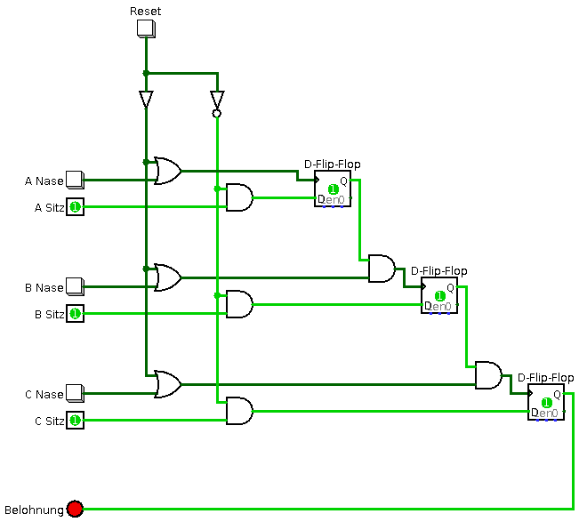

# Logisim Circuit Snippets

A collection of funny, nerdy circuits for [Logisim](http://www.cburch.com/logisim/). These digital circuits have been written during my course in *Structured computer organization* (1st Semester, 2014) based on the reference work from Andrew S. Tanenbaum.

### Hamming Distance

Calculates the hamming distance of two 4-bit input codes.

### Animal Training

Homework Assignment: An "*animal*" needs to sit on every chair from A to C and hit the nearby button each time to get its final reward.

### 7 Segment Display

Binary to decimal 7 segment display.

### 1-Bit Execution Unit

Based on the famous Tanenbaum 1-Bit ALU design for the Mic-1 CPU.

### 4-Bit ALU

Chained 1-bit ALUs to calculate basic operations (add, sub, not, neg, inc, and, or, true, false) on two half-byte inputs.

